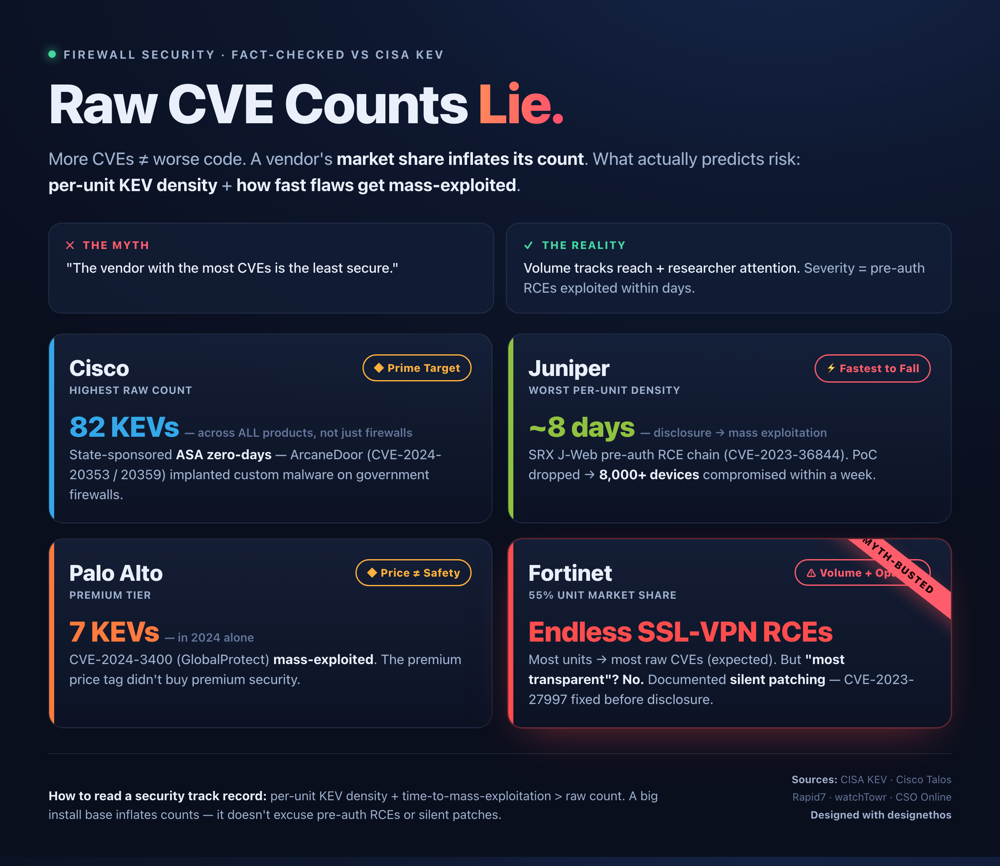

# Perimeter & Edge Vendor Security Track Records

> **Raw CVE and KEV counts mislead.** A vendor's market share inflates both its vulnerability count and the researcher attention it attracts — a large installed base is a confounding variable, not a verdict. This repository ranks perimeter and edge security vendors by the metrics that actually predict operator risk: **per-unit KEV density**, **time from disclosure or PoC to mass exploitation**, and **disclosure transparency plus vendor-side security**. Not raw counts.

If you take one thing from this repo: the vendor with the most KEV entries is not the riskiest vendor here. The riskiest one turned its own cloud backup infrastructure into an attack platform against its entire customer base — and then told customers fewer than 5% were affected when the real number was all of them.

---

## The Scorecard

Ranked #1 (highest demonstrated risk) to #6. The "metric that damns them" column is the single signal that most drives placement — not the raw count.

| Rank | Vendor | The metric that damns them | One-line verdict |
|------|--------|---------------------------|------------------|
| **#1** | **[SonicWall](docs/SonicWall.md)** | **Vendor-side breach: own backup cloud weaponized against all cloud-backup customers; 5%→100% scope revision** | A critical VPN flaw exploited at scale *plus* a vendor infrastructure breach that fed downstream ransomware — institutional failure stacked on technical failure. |
| #2 | [Ivanti](docs/Ivanti.md) | Back-to-back chained zero-days exploited *before* any patch; recurrence one year later | Time-to-mass-exploitation measured in hours-to-days, every time; defensive tooling that adversaries defeated. |
| #3 | [Juniper Networks](docs/Juniper.md) | ~8 days from advisory to mass exploitation (2023 J-Web chain); nation-state interest in carrier-grade routers | Individually "Medium" CVEs that chained to 9.8 Critical and were weaponized before most operators read the advisory. |
| #4 | [Cisco](docs/Cisco.md) | Sustained state-actor targeting: one actor cluster burned **four** ASA/FTD zero-days across two campaigns | High raw KEV count is mostly installed-base scale; the real signal is a durable, well-resourced adversary iterating Cisco-specific implants. |
| #5 | [Palo Alto Networks](docs/PaloAlto.md) | Seven 2024 KEV entries; three were pre-patch or near-zero-day (not a market-share artifact) | Premium price did not correlate with lower compromise probability through the device you bought for protection. |
| #6 | [Fortinet](docs/Fortinet.md) | Four SSL-VPN pre-auth RCEs in one daemon over five years; documented silent patching | Largest unit-count vendor, *worst-in-class* disclosure transparency — the opposite of the "most transparent" myth. |

**Why #6 isn't "best":** Fortinet sits last on *demonstrated incident impact within this review window*, not on safety. Its disclosure posture is the worst here. Ranking is about risk concentration and recency, not a clean bill of health. See [methodology](METHODOLOGY.md).

---

## Per-Vendor Capsules

### #1 — SonicWall · *the focal point*

SonicWall earns the top slot not on raw CVE volume but on **two compounding failures inside twelve months**.

**The vulnerability.** [CVE-2024-40766](https://nvd.nist.gov/vuln/detail/CVE-2024-40766) (CVSS 9.3) is an improper access-control flaw in SonicOS management and SSL VPN across Gen 5, 6, and 7 devices, disclosed August 22, 2024 and [added to CISA KEV on September 9, 2024](https://www.helpnetsecurity.com/2024/09/10/cve-2024-40766-exploited/). Akira and Fog ransomware affiliates ran a sustained campaign through unpatched SSL VPNs; [Arctic Wolf documented over 30 Akira/Fog intrusions exploiting CVE-2024-40766 from August 2024 (~75% Akira, ~25% Fog)](https://arcticwolf.com/resources/blog/fog-ransomware-now-targeting-the-financial-sector/), with full network encryption achieved in under ten hours in documented cases. A structural accelerant: operators migrating Gen 6 → Gen 7 frequently reused credentials without resetting passwords. Akira activity **resurged in July 2025** — [Arctic Wolf observed a July 2025 uptick in Akira activity targeting SonicWall SSL VPN](https://arcticwolf.com/resources/blog/arctic-wolf-observes-july-2025-uptick-in-akira-ransomware-activity-targeting-sonicwall-ssl-vpn/); the broader peak followed in August 2025, when [Huntress documented 28 incidents in a single week](https://thehackernews.com/2025/08/sonicwall-confirms-patched.html) and SonicWall reported investigating fewer than 40.

**The vendor-side breach.** In September 2025 SonicWall disclosed that [an API code change introduced in February 2025](https://www.bleepingcomputer.com/news/security/marquis-sues-sonicwall-over-backup-breach-that-led-to-ransomware-attack/), combined with brute-force attacks, exposed MySonicWall cloud backup files — AES-256-encrypted credentials, MFA scratch codes, VPN configs, network topology, firewall rules. SonicWall initially claimed fewer than 5% of customers were affected, then [revised that to *all* cloud-backup customers after a Mandiant-led investigation](https://www.cybersecuritydive.com/news/sonicwall-investigation-hackers-access-customer-backup/802598/) concluded October 8, 2025. Mandiant attributed the intrusion to state-sponsored actors. No public explanation for the 20x discrepancy was offered. The stolen configurations did not sit idle: they fed a [ransomware attack on Marquis Software Solutions that affected 74 U.S. banks; Marquis sued SonicWall in February 2026](https://www.bleepingcomputer.com/news/security/marquis-sues-sonicwall-over-backup-breach-that-led-to-ransomware-attack/) and now faces 36+ consumer class actions of its own.

**Transparency: Poor.** A 20x scope understatement held for three weeks, no accounting for the error. **One claim we won't make:** a "~438,000 exposed devices" figure circulated in early notes could not be confirmed against any primary source (CISA, Rapid7, Huntress, Arctic Wolf) and should not be cited until one exists.

→ **[Full SonicWall analysis](docs/SonicWall.md)**

---

### #2 — Ivanti

The January 2024 crisis began with two chained zero-days in Connect Secure: [CVE-2023-46805](https://unit42.paloaltonetworks.com/threat-brief-ivanti-cve-2023-46805-cve-2024-21887/) (auth bypass, CVSS 8.2) and [CVE-2024-21887](https://unit42.paloaltonetworks.com/threat-brief-ivanti-cve-2023-46805-cve-2024-21887/) (command injection, CVSS 9.1) — together an unauthenticated RCE, both exploited before disclosure. [Mandiant attributed the campaign to UNC5221, a China-nexus group](https://cloud.google.com/blog/topics/threat-intelligence/investigating-ivanti-exploitation-persistence/) (~1,700 appliances compromised by mid-January), prompting [CISA Emergency Directive ED 24-01](https://www.cisa.gov/news-events/directives/ed-24-01-mitigate-ivanti-connect-secure-and-ivanti-policy-secure-vulnerabilities). A third zero-day, [CVE-2024-21893](https://www.bleepingcomputer.com/news/security/newest-ivanti-ssrf-zero-day-now-under-mass-exploitation/) (SSRF, CVSS 8.2), reached mass exploitation within days. CISA found Ivanti's Integrity Checker Tool could be defeated and that factory resets might not remove persistence — a finding [Ivanti publicly disputed](https://www.bankinfosecurity.com/ivanti-disputes-cisa-findings-post-factory-reset-hacking-a-24492). watchTowr found a fourth flaw (CVE-2024-22024) while auditing the patch. The pattern repeated in 2025 with [CVE-2025-0282](https://www.cisa.gov/news-events/alerts/2025/01/08/cisa-adds-one-vulnerability-kev-catalog) (unauthenticated RCE, CVSS ~9.0), exploited from mid-December 2024 (SPAWN/DRYHOOK/PHASEJAM malware).

→ **[Full Ivanti analysis](docs/Ivanti.md)**

---

### #3 — Juniper Networks

On August 17, 2023 Juniper issued an [out-of-cycle bulletin (JSA72300)](https://supportportal.juniper.net/s/article/2023-08-Out-of-Cycle-Security-Bulletin-Junos-OS-SRX-Series-and-EX-Series-Multiple-vulnerabilities-in-J-Web-can-be-combined-to-allow-a-preAuth-Remote-Code-Execution?language=en_US) for four J-Web CVEs, each rated only CVSS 5.3 individually but **9.8 as a chain**. Eight days later [watchTowr published a working PoC](https://labs.watchtowr.com/cve-2023-36844-and-friends-rce-in-juniper-firewalls/) and [exploitation began the same day](https://www.bleepingcomputer.com/news/security/hackers-exploit-critical-juniper-rce-bug-chain-after-poc-release/). Shadowserver counted ~8,200 exposed J-Web instances; [later scans (Rapid7/VulnCheck) put vulnerable internet-exposed devices near 12,000](https://www.rapid7.com/blog/post/2023/08/31/etr-exploitation-of-juniper-networks-srx-series-and-ex-series-devices/). CISA added the chain to KEV in November 2023. In 2025, [Mandiant disclosed UNC3886 backdooring Juniper MX routers](https://cloud.google.com/blog/topics/threat-intelligence/china-nexus-espionage-targets-juniper-routers): the actor gained access via stolen legitimate credentials, then leveraged CVE-2025-21590 (local, requires shell) to inject code into process memory and bypass Veriexec — not for initial access. Transparency is **adequate**: timely advisory, no documented silent patching, but the medium-CVE framing created a patch-urgency deficit. *The "worst per-unit KEV density" framing is derived analytical reasoning, not a published statistic.*

→ **[Full Juniper analysis](docs/Juniper.md)**

---

### #4 — Cisco

Cisco leads the KEV catalog with **~82 entries — but that figure spans all product lines** (IOS/IOS XE, routers, switches, VPN concentrators), *not* ASA/FTD firewalls alone. Attributing it to "Cisco firewalls" is a common misread. The real signal is **ArcaneDoor**: [Cisco Talos attributed](https://blog.talosintelligence.com/arcanedoor-new-espionage-focused-campaign-found-targeting-perimeter-network-devices/) a state-sponsored campaign (UAT4356 / STORM-1849) exploiting [CVE-2024-20353](https://nvd.nist.gov/vuln/detail/cve-2024-20353) (DoS/reboot, CVSS 8.6) and [CVE-2024-20359](https://nvd.nist.gov/vuln/detail/cve-2024-20359) (persistent local code execution, CVSS 6.0, later raised to High). **Line Runner persistence was achieved via CVE-2024-20359** (disk0 file write + legacy VPN client pre-load hook); CVE-2024-20353 supplied the controlled reload step. The same actor returned in 2025 with [CVE-2025-20333 (CVSS 9.9 RCE) and CVE-2025-20362 (CVSS 6.5)](https://www.tenable.com/blog/cve-2025-20333-cve-2025-20362-faq-cisco-asa-ftd-zero-days-uat4356) and new RayInitiator/LINE VIPER tooling. Transparency is **above average** — [multi-agency coordinated disclosure](https://sec.cloudapps.cisco.com/security/center/resources/asa_ftd_attacks_event_response) and an honest retroactive CVSS elevation.

→ **[Full Cisco analysis](docs/Cisco.md)**

---

### #5 — Palo Alto Networks

CISA logged [seven Palo Alto KEV entries in 2024](https://www.cisa.gov/known-exploited-vulnerabilities-catalog?search_api_fulltext=Palo+Alto) — but **only four affect PAN-OS firewall software**; the other three hit Expedition, an optional migration utility. That distinction matters for per-unit risk, not for accountability: Palo Alto built Expedition and stored customer firewall credentials in it. The standout is [CVE-2024-3400](https://security.paloaltonetworks.com/CVE-2024-3400) (CVSS 10.0, unauthenticated root) — discovered *in active exploitation* by Volexity (Operation MidnightEclipse, UTA0218), not reported by the vendor. The November [CVE-2024-0012 + CVE-2024-9474](https://www.wiz.io/blog/cve-2024-0012-pan-os-vulnerability-exploited-in-the-wild) chain surged within 48 hours of a public PoC. Three [Expedition CVEs](https://cyberscoop.com/palo-alto-expedition-firewall-exploit-cisa-kev/) provided a lateral pivot into every firewall they managed. Transparency: **mixed** — advisories are published (no silent-patch pattern), but initial severity language has lagged what researchers later confirmed.

→ **[Full Palo Alto analysis](docs/PaloAlto.md)**

---

### #6 — Fortinet

Fortinet's FortiGate is the most widely deployed firewall by unit count ([the company claims 50%+ global *unit* share](https://www.fortinet.com/products/next-generation-firewall) — appliance shipments, not revenue). Its `sslvpnd` daemon produced **four KEV-cataloged pre-auth vulnerabilities over five years**: [CVE-2020-12812](https://securityaffairs.com/186117/security/five-year-old-fortinet-fortios-ssl-vpn-flaw-actively-exploited.html) (2FA bypass, still re-exploited in late 2025), [CVE-2022-42475](https://www.sentinelone.com/vulnerability-database/cve-2022-42475/), [CVE-2023-27997 / XORtigate](https://nvd.nist.gov/vuln/detail/CVE-2023-27997), and [CVE-2024-21762](https://nvd.nist.gov/vuln/detail/CVE-2024-21762). The common claim that Fortinet is "most transparent" is **false**: with XORtigate, Fortinet [silently shipped firmware ~3–4 days before any advisory](https://labs.watchtowr.com/xortigate-or-cve-2023-27997/) — watchTowr reproduced the bug by diffing the firmware before disclosure. For CVE-2024-21762, the advisory landed February 8, 2024 and CISA KEV the next day (February 9) — advisory and KEV within ~24h, signaling active exploitation. In April 2025, [a symlink persistence technique](https://www.bleepingcomputer.com/news/security/fortinet-says-ssl-vpn-pre-auth-rce-bug-is-exploited-in-attacks/) let prior compromises survive patching. Largest installed base, **worst disclosure posture** here.

→ **[Full Fortinet analysis](docs/Fortinet.md)**

---

## How to Read a Security Track Record

Vendor security is routinely judged by the wrong number. A short field guide:

1. **A high raw CVE/KEV count is partly a popularity tax.** More installed units → more researcher attention → more disclosed bugs → more KEV entries. Cisco's ~82 KEVs reflect installed-base scale across *all products*; Fortinet's count is inflated by a 50%+ unit denominator. Normalize before you compare.

2. **Per-unit KEV density is the better lens — but it's derived, not published.** No authority publishes "KEVs per deployed device." Where we reason about density (e.g., Juniper, Ivanti's single product line), we present it as analytical reasoning, not a benchmark figure. See [methodology](METHODOLOGY.md).

3. **Time-to-mass-exploitation is the metric market share cannot fake.** A pre-patch zero-day (Palo Alto CVE-2024-3400) or an 8-day advisory-to-exploitation window (Juniper J-Web) tells you how fast you must move — independent of how popular the vendor is.

4. **Transparency is a security control.** Silent patching (Fortinet/XORtigate), firmware-only distribution, disputed government findings (Ivanti), and 20x scope understatements (SonicWall) all degrade an operator's ability to triage. A vendor that discloses *inaccurately* can be worse than one that discloses late.

5. **Vendor-side security is part of the attack surface.** SonicWall's cloud backup breach and Palo Alto's Expedition credential store show that the management plane around a device is as exploitable as the device.

---

## Caveats

- **Per-unit density is derived, not a published statistic.** Treat density claims as a lens, not a benchmark.
- **Market-share normalization is approximate.** Unit share ≠ revenue share, and exposed-device counts vary by scanner and date (e.g., Juniper J-Web: ~8,200 vs ~12,000 depending on source).
- **This is a snapshot.** Track records evolve; recency is weighted but the window is bounded.
- **Ranking ≠ buy/don't-buy.** It measures demonstrated incident risk and disclosure posture, not total product quality or feature fit.
- **Unverified figures are flagged, not cited** (e.g., SonicWall's "~438k exposed devices").

## Data Sources

[CISA KEV catalog](https://www.cisa.gov/known-exploited-vulnerabilities-catalog), [NVD](https://nvd.nist.gov/), vendor PSIRT advisories, [CISA Emergency Directives](https://www.cisa.gov/news-events/directives), and reporting from Cisco Talos, Rapid7, watchTowr, Mandiant/Google Threat Intelligence, Arctic Wolf, Huntress, BleepingComputer, and The Hacker News. Every factual claim above carries an inline citation.

**Corrections welcome.** If a figure is wrong or a source is stale, open an issue with a primary source — see [methodology](METHODOLOGY.md#corrections-welcome).
