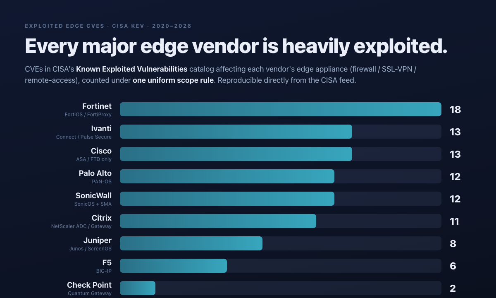

# Edge Security Ground Truth

**Uniform, reproducible, cited exploitation data for perimeter & edge security vendors — firewalls, SSL‑VPN gateways, and remote‑access appliances.**

> **This is data, not a ranking.** We do not score vendors, weight signals into a single number, or name a "worst." We publish a reproducible count and individually‑sourced facts, and let you weigh them against your own threat model.

---

## Why not just count CVEs?

"Which vendor has the most CVEs?" is one of the most documented bad questions in vulnerability management. A raw count ignores *where* the bugs are, ignores whether anyone ever exploited them (only **~2% of CVEs are ever exploited in the wild**), rewards opacity (open‑source projects file a CVE per fix and inflate counts; closed‑source vendors bundle or ship silently), and compares uneven data (35–82% of vendor reports lack a CVSS score — [arXiv:2006.15074](https://arxiv.org/abs/2006.15074), [xmcyber](https://xmcyber.com/blog/your-cve-count-is-a-meaningless-metric/)). A high count is also partly a **popularity tax**: more installed base draws more researcher attention and more attacker ROI.

So we measure **exploited‑vulnerability signals**, drawn from exploitation‑focused frameworks and applied identically to each vendor's **internet‑facing edge appliance only** (firewall / SSL‑VPN / remote‑access gateway — *not* the whole portfolio):

- **[CISA KEV](https://www.cisa.gov/known-exploited-vulnerabilities-catalog)** — confirmed in‑the‑wild exploitation; our gating filter (measure exploited, not total).
- **[EPSS](https://www.first.org/epss/)** (FIRST.org) — ML probability of exploitation within 30 days; a supporting indicator only (CVE‑only, can lag edge exploitation).
- **[Mandiant / GTIG Time‑to‑Exploit](https://cloud.google.com/blog/topics/threat-intelligence)** — days from disclosure to first observed exploitation; the 2024 average was **−1 day** (exploited *before* patch), and **44% of 2024 zero‑days targeted security/edge appliances**. Academic corroboration: [arXiv:2405.01289](https://arxiv.org/abs/2405.01289).
- **[VulnCheck 2026 State of Exploitation](https://www.vulncheck.com/blog/network-edge-device-report-2026)** — 42.5% of 2025 exploited vulnerabilities hit EOL devices; the edge is the primary battleground (why we scope to edge only).

Full definitions, the scope rule, and limitations: **[METHODOLOGY.md](./METHODOLOGY.md)**.

---

## The backbone: exploited edge‑CVEs (CISA KEV), computed reproducibly

The table counts **CISA‑KEV‑listed CVEs affecting each vendor's edge appliance**, by KEV `dateAdded` within **2020‑01‑01 → 2026‑06‑18**, under one scope rule applied uniformly (firewall / SSL‑VPN / remote‑access gateway; endpoint, management, email, WAF, switch and router products excluded). It is produced by [`scripts/build_kev_counts.py`](./scripts/build_kev_counts.py) directly from the [live CISA feed](https://www.cisa.gov/sites/default/files/feeds/known_exploited_vulnerabilities.json) — **re‑run it to reproduce or update every number.**

*Sorted by count, descending. This is a sort, not a verdict.*

| Vendor | Edge product in scope | Exploited edge CVEs (KEV) |
|--------|-----------------------|--------------------------:|
| [Fortinet](docs/Fortinet.md) | FortiOS / FortiProxy SSL‑VPN | **18** |
| [Ivanti](docs/Ivanti.md) | Connect Secure / Pulse Secure VPN | **13** |
| [Cisco](docs/Cisco.md) | ASA / FTD firewall *(ASA/FTD only — not Cisco's portfolio‑wide KEV total)* | **13** |
| [Palo Alto Networks](docs/PaloAlto.md) | PAN‑OS *(Expedition excluded)* | **12** |
| [SonicWall](docs/SonicWall.md) | SonicOS firewall + SMA remote‑access | **12** |
| [Citrix](docs/Citrix.md) | NetScaler ADC / NetScaler Gateway | **11** |
| [Juniper Networks](docs/Juniper.md) | Junos OS (J‑Web) / ScreenOS | **8** |
| [F5 Networks](docs/F5.md) | BIG‑IP (APM / LTM) | **6** |
| [Check Point](docs/CheckPoint.md) | Quantum Security Gateway | **2** |



**The most important takeaway is the spread, not the order.** Under a consistent scope, the nine major edge vendors sit between **2 and 18** exploited edge CVEs over six years — all under active exploitation. Fortinet's higher count tracks its **~50% unit market share** (the popularity tax we can't normalize away), not demonstrably weaker code. Check Point's low count (2) partly reflects fewer disclosed edge vulnerabilities but also lower installed base and researcher attention — it does **not** mean Check Point is safe (CVE‑2024‑24919 was exploited at scale by nation‑states). **No vendor is dramatically cleaner than the others.** Anyone selling you "vendor X is secure, vendor Y isn't" on raw counts is selling you noise. (See [Caveats](#caveats-sources--corrections): counts still partly reflect installed base, which we cannot normalize away.)

The full per‑vendor CVE lists with KEV dates are in [`scripts/kev_edge_counts.json`](./scripts/kev_edge_counts.json) (regenerated by the script).

---

## What the count doesn't tell you — per‑vendor signals (each cited)

The count says *how many* edge bugs were exploited. It does **not** say how fast, whether attackers beat the patch, or whether the vendor's own conduct made things worse. Those are partly interpretive, so we present them as **sourced facts, not aggregate scores.** Weigh whichever matters to your deployment.

### Fortinet — FortiOS / FortiProxy SSL‑VPN
A multi‑year run of pre‑auth SSL‑VPN flaws: [CVE‑2022‑42475](https://nvd.nist.gov/vuln/detail/CVE-2022-42475), [CVE‑2023‑27997](https://nvd.nist.gov/vuln/detail/CVE-2023-27997), and [CVE‑2024‑21762](https://nvd.nist.gov/vuln/detail/CVE-2024-21762) are all pre‑authentication remote code execution. **Documented silent patch:** CVE‑2023‑27997 ("XORtigate") shipped as a fixed firmware build ~3–4 days **before** the advisory; researchers reproduced it by diffing the firmware before customers were told ([watchTowr](https://labs.watchtowr.com/xortigate-or-cve-2023-27997/), [Tenable](https://www.tenable.com/blog/cve-2023-27997-heap-based-buffer-overflow-in-fortinet-fortios-and-fortiproxy-ssl-vpn-xortigate)). CVE‑2024‑21762 was added to CISA KEV the day after disclosure (Feb 9 2024), signaling exploitation was already active. Also KEV‑listed (under CISA's generic "Multiple Products" label): the FortiOS auth bypasses [CVE‑2022‑40684](https://nvd.nist.gov/vuln/detail/CVE-2022-40684) (mass‑exploited, 2022) and [CVE‑2026‑24858](https://www.cisa.gov/news-events/alerts/2026/01/28/fortinet-releases-guidance-address-ongoing-exploitation-authentication-bypass-vulnerability-cve-2026) (FortiCloud SSO, actively exploited Jan 2026), and the FortiOS RCE [CVE‑2024‑23113](https://nvd.nist.gov/vuln/detail/CVE-2024-23113). **June 2026 — [FortiBleed](https://cyberscoop.com/ortinet-zero-day-cve-2026-24858-forticloud-sso-auth-bypass/):** credentials for ~74,000 internet‑facing FortiGates surfaced; researchers attribute it to *already‑known* flaws (chiefly CVE‑2026‑24858) plus legacy hashing and recycled credentials — not a new zero‑day.

### Ivanti — Connect Secure / Pulse Secure VPN
The Jan 2024 [CVE‑2023‑46805](https://cloud.google.com/blog/topics/threat-intelligence/ivanti-connect-secure-vpn-zero-day) + [CVE‑2024‑21887](https://cloud.google.com/blog/topics/threat-intelligence/ivanti-connect-secure-vpn-zero-day) chain was an unauthenticated RCE **exploited before any patch** (~weeks pre‑patch, China‑nexus UNC5221), severe enough to trigger [CISA Emergency Directive 24‑01](https://www.cisa.gov/news-events/directives/emergency-directive-24-01) ordering federal agencies to disconnect — a rare step for a commercial VPN. CISA also reported the Integrity Checker Tool could be defeated and factory resets might not remove persistence (a finding [Ivanti disputed](https://www.bankinfosecurity.com/ivanti-disputes-cisa-findings-post-factory-reset-hacking-a-24492)). The pattern recurred in 2025 with [CVE‑2025‑0282](https://www.cisa.gov/news-events/alerts/2025/01/08/cisa-adds-one-vulnerability-kev-catalog) (pre‑auth RCE).

### Cisco — ASA / FTD firewall
The defining events are state‑sponsored. **ArcaneDoor** ([Talos](https://blog.talosintelligence.com/arcanedoor-new-espionage-focused-campaign-found-targeting-perimeter-network-devices/), actor UAT4356 / STORM‑1849) exploited [CVE‑2024‑20353](https://nvd.nist.gov/vuln/detail/CVE-2024-20353) + [CVE‑2024‑20359](https://nvd.nist.gov/vuln/detail/CVE-2024-20359) as zero‑days on government firewalls, implanting Line Dancer / Line Runner; the same actor returned in 2025 with the [CVE‑2025‑20333 + CVE‑2025‑20362](https://www.tenable.com/blog/cve-2025-20333-cve-2025-20362-faq-cisco-asa-ftd-zero-days-uat4356) pre‑auth RCE chain (CISA Emergency Directive ED 25‑03). Cisco's disclosure was **multi‑agency coordinated** with indicators released alongside patches — comparatively strong transparency. *(Cisco's headline ~80+ KEV total spans IOS, switches, routers and SD‑WAN; only the 13 ASA/FTD entries are counted here.)*

### Palo Alto Networks — PAN‑OS
[CVE‑2024‑3400](https://www.volexity.com/blog/2024/04/12/zero-day-exploitation-of-unauthenticated-remote-code-execution-vulnerability-in-globalprotect-cve-2024-3400/) (GlobalProtect, CVSS 10.0, unauthenticated RCE) was discovered **already under active exploitation** by Volexity (~19 days before the hotfix) — a true zero‑day found by a researcher, not the vendor. The Nov 2024 [CVE‑2024‑0012 + CVE‑2024‑9474](https://www.wiz.io/blog/cve-2024-0012-pan-os-vulnerability-exploited-in-the-wild) management‑interface chain reached exploitation within ~48 hours of a public PoC. Two 2026 PAN‑OS entries (CVE‑2026‑0300, CVE‑2026‑0257) are recent KEV additions. No documented silent‑patch or vendor‑side breach.

### SonicWall — SonicOS firewall + SMA remote‑access
[CVE‑2021‑20016](https://www.tenable.com/blog/cve-2021-20016-sonicwall-ssl-vpn-zero-day-vulnerability-exploited-in-the-wild) (SSL‑VPN SMA100) was exploited as a zero‑day before a patch; [CVE‑2021‑20038](https://www.rapid7.com/blog/post/2022/01/12/sonicwall-sma-100-series-multiple-vulnerabilities-fixed/) and [CVE‑2025‑23006](https://www.cisa.gov/news-events/alerts) are pre‑auth RCEs in the SMA line; [CVE‑2024‑40766](https://securityaffairs.com/170359/cyber-crime/fog-akira-ransomware-sonicwall-vpn-flaw.html) (SonicOS) was mass‑exploited by Akira/Fog ransomware (Arctic Wolf documented 30+ intrusions). **The distinguishing event is vendor‑side:** the Sept 2025 [MySonicWall cloud‑backup breach](https://www.cisa.gov/news-events/alerts/2025/09/22/sonicwall-releases-advisory-customers-after-security-incident) exposed firewall configuration backups for cloud‑backup customers — initially stated as "<5%," later revised to all — attributed to a state‑sponsored actor.

### Juniper Networks — Junos (J‑Web) / ScreenOS
The 2023 J‑Web chain ([CVE‑2023‑36844](https://www.rapid7.com/blog/post/2023/08/31/etr-exploitation-of-juniper-networks-srx-series-and-ex-series-devices/) and siblings) is notable for *severity laundering*: four individually CVSS‑5.3 "Medium" bugs that chain to a 9.8 pre‑auth RCE — exploited ~8 days **after** the advisory, so within this edge‑remote scope Juniper has **no confirmed pre‑patch zero‑day**. In 2025, [CVE‑2025‑21590](https://cloud.google.com/blog/topics/threat-intelligence/china-nexus-espionage-targets-juniper-routers) was used by UNC3886 to backdoor MX routers — but via *stolen credentials* for entry, with the CVE used for in‑memory/Veriexec bypass (local, not pre‑auth remote). No documented silent‑patch or vendor‑side breach.

### Citrix — NetScaler ADC / NetScaler Gateway
[CVE‑2019‑19781](https://nvd.nist.gov/vuln/detail/CVE-2019-19781) (path traversal, CVSS 9.8) was **mass‑exploited in January 2020** within days of public PoC — one of the most impactful edge CVEs ever, affecting tens of thousands of NetScaler deployments. In 2023, the pattern repeated twice: [CVE‑2023‑3519](https://www.cisa.gov/news-events/cybersecurity-advisories/aa23-201a) was an unauthenticated RCE **exploited before any patch** (zero‑day, thousands of devices backdoored with webshells), and [CVE‑2023‑4966](https://nvd.nist.gov/vuln/detail/CVE-2023-4966) ("**CitrixBleed**") was a session token leak exploited by [LockBit ransomware](https://www.cisa.gov/news-events/cybersecurity-advisories/aa23-325a) at Boeing, DP World, ICBC, and Allen & Overy within weeks of disclosure — one of the most impactful single CVEs of 2023. Citrix's initial advisory for CitrixBleed classified it as "high" rather than "critical" despite the severity of impact. Two 2025 entries (CVE‑2025‑6543, CVE‑2025‑5777) are recent additions.

### F5 Networks — BIG‑IP
[CVE‑2020‑5902](https://nvd.nist.gov/vuln/detail/CVE-2020-5902) (TMUI RCE, CVSS 9.8) was mass‑exploited in July 2020. [CVE‑2022‑1388](https://nvd.nist.gov/vuln/detail/CVE-2022-1388) (iControl REST unauthenticated bypass, CVSS 9.8) was exploited **within two days** of public PoC — one of the fastest mass‑exploitation events in the dataset and among the most‑exploited edge CVEs of 2022. The Oct 2023 [CVE‑2023‑46747 + CVE‑2023‑46748](https://www.f5.com/labs/articles/threat-intelligence/f5-sirt-cve-2023-46747-cve-2023-46748-evidence-of-exploitation) chain (auth bypass + RCE in BIG‑IP Configuration Utility) was confirmed exploited in the wild. BIG‑IP APM's SSL VPN and access gateway role places it directly in scope; the load‑balancer and WAF functions are not counted. No documented silent‑patch or vendor‑side breach.

### Check Point — Quantum Security Gateway
[CVE‑2024‑24919](https://nvd.nist.gov/vuln/detail/CVE-2024-24919) (SSL VPN path traversal, CVSS 8.6) was actively exploited by nation‑state actors (including Iran‑nexus campaigns); over 10,000 devices were scanned within 48 hours of PoC publication. Check Point published an advisory promptly but initial scope framing lagged external researcher confirmation of mass exploitation. [CVE‑2026‑50751](https://www.cisa.gov/known-exploited-vulnerabilities-catalog) is a recent addition (June 2026). The low count (2) partly reflects fewer disclosed pre‑auth RCE vulnerabilities in Check Point's gateway product line, but also lower researcher attention relative to Fortinet and Palo Alto — it does **not** mean Check Point is safe.

---

## How to use this

**Weigh the facts by your own threat model — there is no single "score" and we deliberately don't provide one.**

- If your appliance is **internet‑facing and unauthenticated‑reachable**, pre‑auth RCE history and pre‑patch (zero‑day) exploitation matter most.
- If you **can't patch within days**, the zero‑day cases dominate — a fix you can't deploy in time barely helps against a bug exploited before its patch existed.
- If your concern is **supply‑chain / management‑plane exposure**, the vendor‑side breach (SonicWall) and silent‑patch (Fortinet) facts weigh heaviest, and a low CVE count is cold comfort.
- **Don't sum these.** A pre‑auth RCE zero‑day and a vendor cloud breach are different *kinds* of risk and aren't commensurable.

---

## The conclusion

This repo does reach a conclusion — just not a per‑vendor verdict. Three findings the data supports:

1. **No major edge vendor is meaningfully safer than the others.** Nine vendors, one consistent scope, **2–18 exploited edge CVEs each** over six years — all actively exploited. The high end (Fortinet, 18) tracks the largest install base, not demonstrably weaker code. The low end (Check Point, 2) partly reflects fewer gateway‑specific disclosures and lower researcher attention, not immunity — CVE‑2024‑24919 was exploited at scale. Choosing a firewall on its CVE reputation is choosing between roughly equivalent exposure.
2. **The exposure is the edge itself, not the brand.** Mandiant's 2024 average time‑to‑exploit went *negative* (exploited before patch), and 44% of 2024 zero‑days hit security/edge appliances. The recurring pattern across every vendor here is identical: an internet‑facing, unauthenticated‑reachable management/VPN surface, exploited fast — often pre‑patch.
3. **So the controllable variable is you, not the vendor.** What separated a breach from a near‑miss in these cases was response posture: time‑to‑patch (or virtual‑patch), whether the management plane was internet‑exposed, whether you assume‑breach and hunt once a KEV lands, and whether you've isolated the vendor's *own* cloud/management services — the [SonicWall cloud‑backup breach](docs/SonicWall.md) is the reminder that the vendor's infrastructure is part of your attack surface.

**Defender takeaway:** treat every edge appliance as a high‑value, actively‑targeted asset *regardless of vendor*, and invest in time‑to‑respond over brand selection. That is the actionable result a raw CVE count cannot give you.

---

## Caveats, sources & corrections

- **The count partly reflects installed base.** Per‑install normalization would correct it, but install‑base figures are proprietary/estimated and conflate unit vs. revenue share — so we publish **no normalized score and fabricate none.** This is the most important limitation.
- **KEV / EPSS are CVE‑only.** Silently‑fixed, bundled, or un‑CVE'd bugs are invisible and understate exposure for weak‑disclosure vendors.
- **Scope is a judgment call, applied transparently.** The include/exclude rule lives in [`scripts/build_kev_counts.py`](./scripts/build_kev_counts.py); disagree with it? Edit the rule and re‑run. SonicWall's count spans firewall + SMA remote‑access; Cisco is ASA/FTD‑only; Palo Alto excludes Expedition.
- **Attribution is probabilistic** (UNC5221, UNC3886, UAT4356 = assessments, not proof). **Bounded window:** 2020‑01‑01 → 2026‑06‑18.
- **Frameworks & sources:** CISA KEV, FIRST.org EPSS, Mandiant/GTIG TTE, VulnCheck 2026, arXiv:2006.15074, arXiv:2405.01289, and per‑vendor first‑party / named research (Volexity, Mandiant, Rapid7, Tenable, watchTowr, Talos, Arctic Wolf, CISA advisories & Emergency Directives) cited inline.
- **Freshness:** counts verified against **CISA KEV catalog 2026.06.18**; re‑run [`build_kev_counts.py`](./scripts/build_kev_counts.py) against the live feed to update. Latest tracked Fortinet development: FortiBleed (June 2026) — see the [Fortinet doc](docs/Fortinet.md).
- **Corrections welcome.** Open an issue with a primary source. Unconfirmed figures are flagged or excluded, never asserted.

**Full methodology, scope rule, and limitations: [METHODOLOGY.md](./METHODOLOGY.md).**

---

## Cite this work

```bibtex
@misc{rihm2026edgekev,
  author       = {Eric Rihm},
  title        = {Edge Security Ground Truth: Reproducible CISA KEV Counts for Edge Appliance Vendors},
  year         = {2026},
  publisher    = {GitHub},
  url          = {https://github.com/ericrihm/edge-security-ground-truth},
  note         = {Dataset and methodology for counting CISA KEV entries scoped to edge/perimeter appliances}
}
```

See also [`CITATION.cff`](./CITATION.cff) for machine-readable citation metadata.
